<!-- =========================================================
   ⚡ VIVEK MAHAKUR — FUTURISTIC / CYBER README (Neon Matrix)
   Repo: https://github.com/VivekMahakur/VivekMahakur
   ========================================================== -->

<!-- Hero Banner -->

  

<!-- Typing Heading -->

  

<!-- Quick Links / Status Row -->

  
  
  
  

---

## 🧬 About Me
> Motivated Computer Science undergraduate building real-world web applications using Django & SQL.

- 🎓 **B.Tech CSE (2022–2026)** — ITER, SOA University  
- 💡 Strong foundation in **Python, Java, SQL, Django**  
- 🛠️ Experience building **Inventory Systems & E-Commerce Admin Panels**  
- 🤝 Team player with a strong learning mindset  
- 🌱 Currently improving: **DBMS**, **DSA**, **UI/UX basics**, **clean architecture**

---

## 🧠 Skills Matrix

  
  
  
   
  
  
  
  
   
  
  

---

## 🚀 Flagship Projects
> Projects.

<table>
<tr>
<td width="50%">

### **CocoMatik – E-Commerce Admin Panel**  
`Django` · `HTML` · `CSS` · `Bootstrap` · `SQL`  
- Product, order & shipment management  
- CRUD operations for inventory  
- Clean responsive admin UI  
- SQL-integrated functionalities  

🔗 **Repo:** https://github.com/VivekMahakur/CocoMatik

</td>

<td width="50%">

### **Inventory Management System**  
`Django` · `Bootstrap` · `SQL`  
- Role-based login (Admin/User)  
- Add / Edit / Delete product inventory  
- Responsive UI  
- SQL database structure  

🔗 **Repo:** https://github.com/VivekMahakur/Inventory_management.git

</td>
</tr>
</table>

---

## 🧪 GitHub Activity Snapshot

  

  
  <!--  -->

---

## 🛰️ Metrics Dashboard 

  

---

## 🐍 Contribution Snake 

  

---

## 🔭 What I'm Learning Now
- Strengthening **DSA fundamentals**  
- Improving **UI/UX skills** for better interfaces  
- Deepening knowledge of **SQL & DBMS**  
- Exploring advanced **Django patterns**  

---

## 🗺️ Roadmap 2025 – 2026
- [ ] Build 3–4 production-ready Django apps  
- [ ] Learn REST APIs with DRF  
- [ ] Strengthen DSA for placements  
- [ ] Improve UI/UX for cleaner UIs  
- [ ] Master SQL query optimization  

---

## 🤝 Connect With Me

  
  
  

---

  

